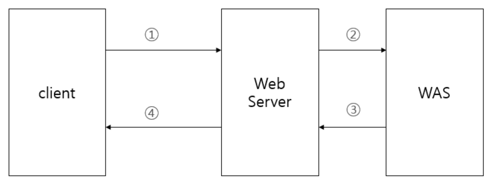
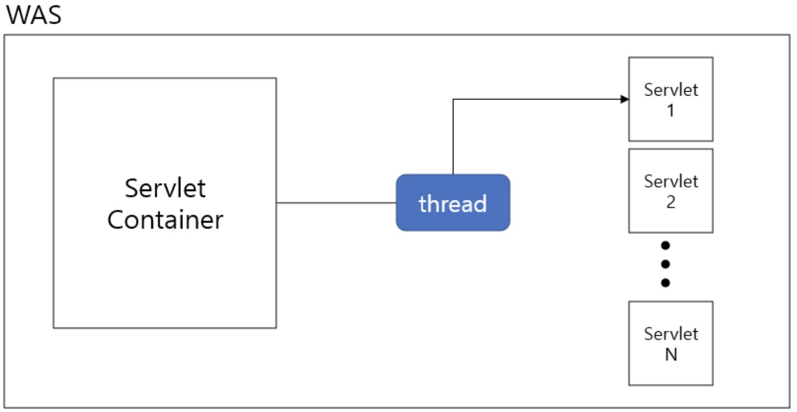

# java-was-2024

Java Web Application Server 2024

## 프로젝트 정보 

WAS란?

- Client로부터 받는 요청을 기존의 정적 웹 서버만으로는 할 수 없었던 동적인 로직을 처리하기 위해 정적 웹 서버로 부터 Request를 받아 처리하는 서버

간단한 WAS구조

Servlet이란?

- WAS의 동적인 로직을 처리해주는 Class 혹은 구현체

즉 thread들을 Servlet Container에서 실행하여 각 Servlet들을 실행한다.
클라이언트와 서버간의 요청과 응답이 이뤄지는 순서를 다시 정리하면 다음과 같다.
(1) 클라이언트가 웹 서버에 요청
(2) 웹 서버는 WAS에 동적인 처리 요청
(3) Servlet Container가 적절한 서블릿을 수행할 쓰레드 할당
(4) 서블릿 수행
(5) WAS가 그 결과를 웹 서버에 전달
(6) 웹 서버가 사용자에게 최종 결과를 전달

이 프로젝트는 우아한 테크코스 박재성님의 허가를 받아 https://github.com/woowacourse/jwp-was 
를 참고하여 작성되었습니다.
